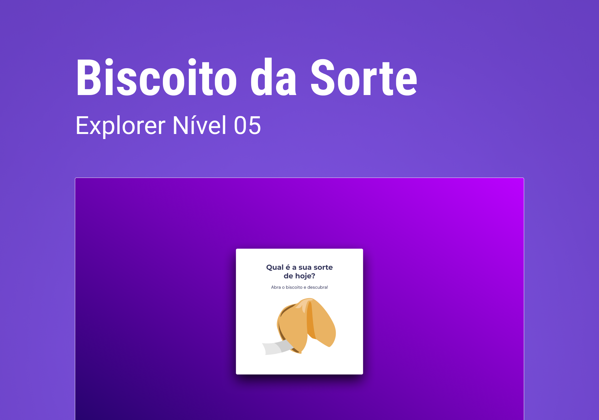

# Biscoito da sorte #

RESUMO: A aplicação consiste no usuário clicar na imagem com o biscoito da sorte e sortear uma frase da contida num Array.

HTML
 - Estruturas semânticas

CSS
  - Animações
  - Fontes
  - Organização de elementos na página
  - Grid e Flex

JAVASCRIPT
  - variáveis
  - funções
  - manipulação de dados
  - manipulação da DOM
  - array
  - Math